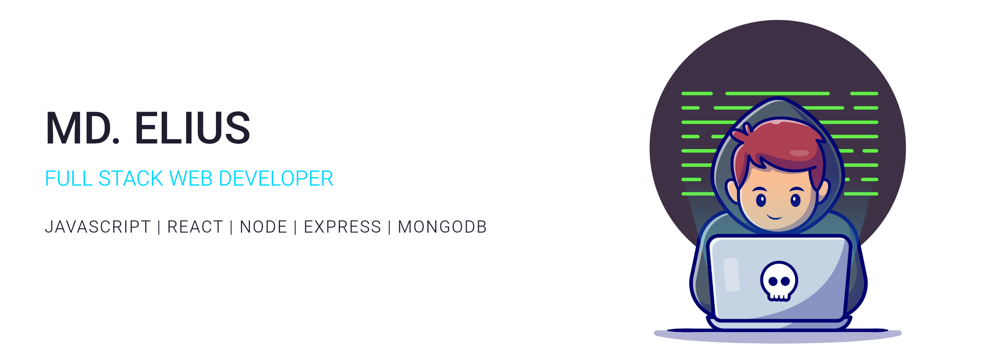

<h1 align="center">
  
</h1>

  
<h2>  About Me </h2>

Hi! I'm **[@md-elius](https://github.com/md-elius)**, an aspiring **Frontend & MERN Stack Developer** passionate about building clean, modern, and user-friendly web applications. I'm continuously learning, improving, and exploring new tools to strengthen my development journey.

<h2>🔥 Current Activities</h2>

<table>
<tr>
<td>

<ul>
  <li>⚡ Exploring modern frontend frameworks like <b>Next.js</b></li>
  <li>🛠️ Working on a <b>Personal Portfolio Website</b> to showcase my projects</li>
  <li>🧪 Experimenting with <b>API integration</b> in JavaScript and React</li>
  <li>🏡 Developing <b>HomeNest – A Real Estate Website</b> (property listing, filtering & UI design)</li>
</ul>

</td>
</tr>
</table>

 

|       Skills Overview        | Technologies                                                                                                                                                                                                                          |
|-----------------------|---------------------------------------------------------------------------------------------------------------------------------------------------------------------------------------------------------------------------------------|
| **Languages**         |                                                       |
| **Frontend Technologies** |       |
| **Back-End Development** |                                               |
| **Database**          |                                                         |
| **Tools & Platforms** |       ! |

 

<!-- Top Languages -->

  

<!-- GitHub Stats -->

  

<!-- GitHub Streak -->

<!--- socials --->

 <h3> FOLLOW ME ON SOCIALS: </h3>

  

    
    
    
    
  
  

